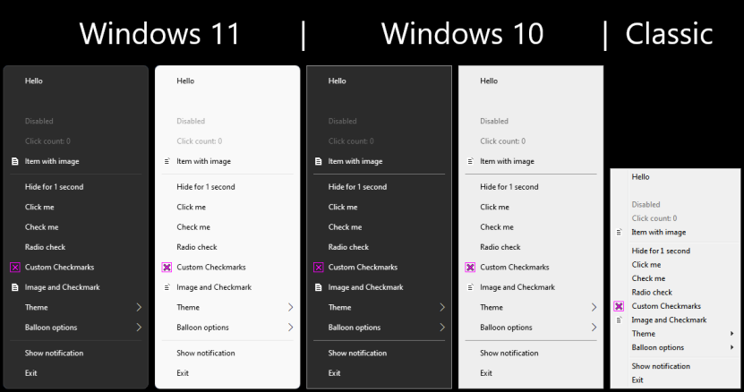

# Modern Notify Icon

## Overview (click on image for hi-res version)

[](gallery/overview.png)

## Features

Most features require minimum version of Windows 10 1603.

- Native Windows 10/11 look
- Windows notifications
- High dpi support
- Right-to-left text support
- Light/Dark/High Contrast theme support
- Fallback compatibility mode for Windows 7/8/8.1/10(pre 1603)

## How to use

You can use either pre-build static library or build library yourself.

### Requirements

- C++ compiler (std:c++17 or later) [only MSVC, other compiler not tested]

### To use pre-build library

1. Download or clone this repository
2. Add additional include directory: ```ModernNotifyIcon/include```
3. Add additional library directory: ```ModernNotifyIcon/lib/$(Platform)/$(Configuration)```
4. Depending on your choice:
    - If you want to use Immersive style:
        - Add ```ImmersiveNotifyIcon.lib``` to linker input if you want to use immersive style (full build)
        - Include ```mni/ImmersiveNotifyIcon.hpp``` in your source file
    - If you want to use Classic style:
        - Add ```ClassicNotifyIcon.lib``` to linker input if you want to use classic style (minimal build)
        - Include ```mni/ClassicNotifyIcon.hpp``` in your source file

## Building

### Requirements

1. Minimum OS of Windows 10
2. Visual Studio 2022 with MSVC v143 and Windows SDK

### To build project

1. Open ```ModernNotifyIcon.sln``` and build projects:
    - **ImmersiveNotifyIcon**
    - **ClassicNotifyIcon**
2. (Optional) Build **Demo** project

On successful build in will output library files in ```ModernNotifyIcon/lib``` directory.</br>
Demo executable will be placed in ```ModernNotifyIcon/bin``` directory.

Pre-build static library is built on Windows 10 21H2.

## Documentation

API documentation can be found [here](docs/README.md).

## License

The MIT License
